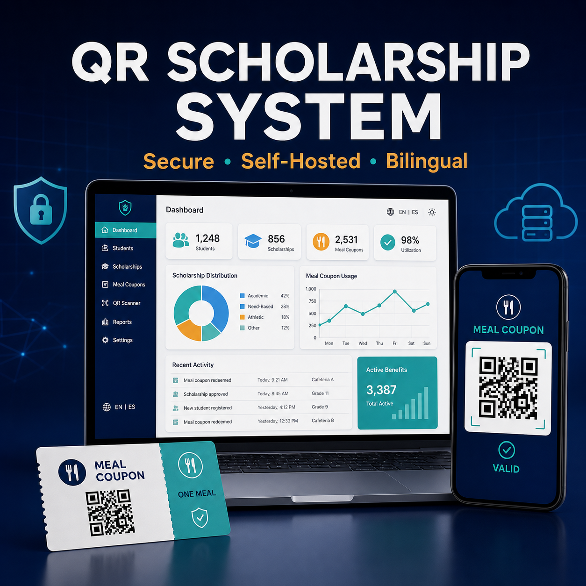

# QR Scholarship & Meal Coupon System

[](https://github.com/BryantFlores12/qr-scholarship-system/actions/workflows/ci.yml)



A self-hosted PHP and SQLite application for schools, nonprofits, cafeterias, and community programs that distribute dated meal benefits. It combines student enrollment, signed QR coupons, controlled redemption, PDF delivery, and role-based operations without requiring an external database server.

## Core workflows

- Student registration with password hashing.
- Scholarship selection and configurable benefit periods.
- Cryptographically signed, deployment-specific QR coupons.
- One-time validation with redemption history.
- Separate administrator and cafeteria access.
- PDF coupon generation and optional SMTP delivery.
- SQLite installation suitable for low-maintenance hosting.

## Technology

| Layer | Technology |
| --- | --- |
| Application | PHP 8.1+ |
| Data | SQLite through PDO |
| QR codes | Simple QrCode |
| Documents | Dompdf |
| Email | PHPMailer and SMTP |

## Requirements

- PHP 8.1 or newer with PDO SQLite.
- Composer.
- Apache, Nginx, or PHP's development server.
- SMTP credentials only when email delivery is enabled.

## Installation

```bash
composer install --no-dev
php -S localhost:8080
```

`.env.example` is a reference list; the application reads process environment variables directly and does not load a local `.env` file by itself. Configure those variables in your hosting panel, web server, container, or shell. Then:

1. Generate password hashes:

   ```bash
   php -r "echo password_hash('replace-this-password', PASSWORD_DEFAULT), PHP_EOL;"
   ```

2. Generate a unique QR secret with at least 32 random characters.
3. Supply the variables from `.env.example` through the hosting control panel or process manager.
4. Ensure the application directory can create the SQLite database.
5. Open `install.php` once, then remove it or restrict access.

## Configuration

| Variable | Purpose |
| --- | --- |
| `APP_ADMIN_USER` | Administrator login |
| `APP_ADMIN_PASSWORD_HASH` | Administrator password hash |
| `APP_CAFETERIA_PASSWORD_HASHES` | Cafeteria password hashes |
| `APP_QR_SECRET` | Secret used to sign and validate coupons |
| `SMTP_*` | Optional email transport and sender settings |

Never commit `.env`, generated databases, logs, or real student records.

## Security checklist

- Serve the application only over HTTPS.
- Use unique password hashes and QR secrets per deployment.
- Restrict administrative routes and rate-limit login attempts at the server or proxy.
- Keep `install.php` unavailable after initialization.
- Back up the SQLite database and test restoration.
- Define privacy, retention, and access rules before storing student data.

## Project structure

- `admin_panel.php`: administrator operations.
- `registro_alumno.php`: student enrollment.
- `QRGenerator.php`: signed coupon generation.
- `validar_cupon.php`: cafeteria validation and redemption.
- `NotificadorService.php`: PDF and email delivery.
- `install.php`: initial SQLite schema setup.

## License

Proprietary commercial software under the terms in `LICENSE_COMMERCIAL.txt`. Redistribution or resale of the source is not included unless separately agreed.
