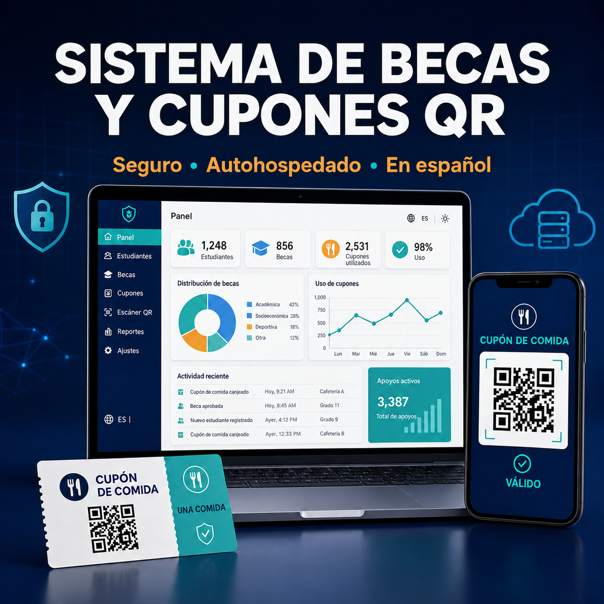

# Sistema de becas y cupones de alimentos con QR

[](https://github.com/BryantFlores12/qr-scholarship-system/actions/workflows/ci.yml)



Este proyecto es una aplicación web que desarrollé con PHP y SQLite para administrar apoyos de comida. Permite registrar estudiantes, asignar becas, generar cupones QR seguros y controlar que cada cupón se utilice una sola vez, sin necesitar un servidor de base de datos externo.

## Funciones principales

- Registro de estudiantes y contraseñas protegidas con hash.
- Selección de becas y periodos de apoyo configurables.
- Cupones QR firmados con una clave propia de cada instalación.
- Validación de un solo uso con historial de entregas.
- Accesos separados para administración y cafetería.
- Generación de cupones en PDF y envío opcional por correo.
- Base de datos SQLite fácil de instalar y mantener.

## Tecnologías

| Área | Tecnología |
| --- | --- |
| Aplicación | PHP 8.1+ |
| Base de datos | SQLite mediante PDO |
| Códigos QR | Simple QrCode |
| Documentos | Dompdf |
| Correo | PHPMailer y SMTP |

## Requisitos

- PHP 8.1 o superior con PDO SQLite.
- Composer.
- Apache, Nginx o el servidor de desarrollo de PHP.
- Credenciales SMTP únicamente si se activa el envío por correo.

## Instalación

```bash
composer install --no-dev
php -S localhost:8080
```

`.env.example` contiene la lista de variables necesarias. La aplicación las lee directamente desde el entorno y no carga un archivo `.env` local por sí sola. Configúralas desde el servidor, contenedor, panel de alojamiento o terminal. Después:

1. Genera los hashes de las contraseñas:

   ```bash
   php -r "echo password_hash('cambia-esta-contrasena', PASSWORD_DEFAULT), PHP_EOL;"
   ```

2. Genera una clave única para los QR con al menos 32 caracteres aleatorios.
3. Configura las variables de `.env.example` en el servidor.
4. Verifica que la aplicación tenga permiso para crear la base de datos SQLite.
5. Abre `install.php` una sola vez y después elimínalo o restringe su acceso.

## Configuración

| Variable | Uso |
| --- | --- |
| `APP_ADMIN_USER` | Usuario de administración |
| `APP_ADMIN_PASSWORD_HASH` | Hash de la contraseña de administración |
| `APP_CAFETERIA_PASSWORD_HASHES` | Hashes de las contraseñas de cafetería |
| `APP_QR_SECRET` | Clave para firmar y validar los cupones |
| `SMTP_*` | Configuración opcional para enviar correos |

No subas a Git archivos `.env`, bases de datos generadas, registros ni información real de estudiantes.

## Seguridad

- Utiliza HTTPS en el servidor.
- Usa contraseñas y claves QR diferentes para cada instalación.
- Protege las rutas administrativas y limita los intentos de inicio de sesión.
- Mantén `install.php` deshabilitado después de la instalación.
- Realiza copias de seguridad de SQLite y comprueba que puedan restaurarse.
- Define reglas de privacidad, conservación y acceso antes de guardar información de estudiantes.

## Archivos principales

- `admin_panel.php`: operaciones de administración.
- `registro_alumno.php`: registro de estudiantes.
- `QRGenerator.php`: generación de cupones firmados.
- `validar_cupon.php`: validación y entrega en cafetería.
- `NotificadorService.php`: generación de PDF y envío por correo.
- `install.php`: creación inicial de la base de datos SQLite.

## Sobre el proyecto

Lo desarrollé para reunir en un solo sistema el registro de beneficiarios, la creación de cupones y el control de cada entrega. También me permitió trabajar con firmas para QR, distintos tipos de usuario, archivos PDF, correo y un historial que facilita revisar los movimientos.
